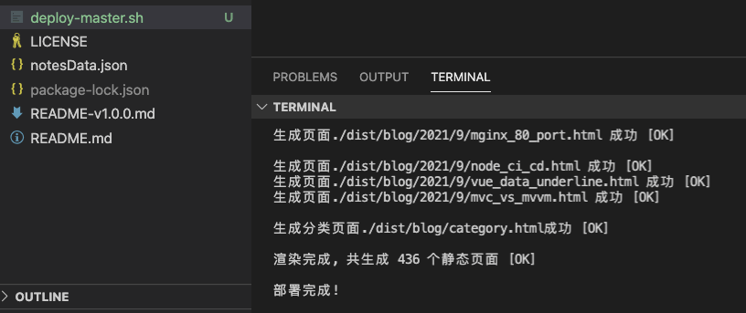

# zuo-deploy
用 js 写一个 CI、CD 工具

## 使用
```bash
# 全局安装
npm install zuo-deploy -g
# 开启服务
zuodeploy start
# 再访问 127.0.0.1:7777 打开操作界面
```


点击部署，会执行当前目录下的 deploy-master.sh，

需要自己在需要部署的项目里，创建一个 deploy-master.sh 脚本，如果没有会直接报错，如上图。

```shell
# https://github.com/zuoxiaobai/zuo11.com 部署脚本示例
# deploy-master.sh
echo "开始部署..."

echo "git pull"
git pull 

echo "zuoblog init"
zuoblog init --disable-dev-server

echo "部署完成!"
```


针对 log 可能输出较慢的问题，在 console 里也有打出 log，看服务器控制台可以实时看 log。

后续优化，使用 socket 实时将 log 信息传给前端


## 项目从 0 到 1 过程

### 基础结构

```bash
# 初始化 package.json
npm init

# 添加 eslint、prettier
npm install eslint@7.32.0 --save-dev
npx eslint --init # 初始化 .eslintrc.json 如果是 js，type 为 module 时改为 .cjs
# 支持 es modlues
# package.json 设置 type 为 module
npm install --save-dev --save-exact prettier
npm install eslint-config-prettier --save-dev # 处理与 eslint 的冲突
npm install eslint-plugin-prettier --save-dev # 将 prettier 以插件形式集成到 eslint 处理流程中
# prettier 如果配置没生效，重启 vscode 即可
# 配置参考 https://github.com/prettier/eslint-plugin-prettier
```

### koa 接口、静态服务
```js
import Koa from "koa";
import KoaStatic from "koa-static";
import KoaRouter from "koa-router";
import path from "path";

const app = new Koa();
const router = new KoaRouter();

router.post("/user", (ctx) => {
  ctx.body = {
    a: 1,
  };
});

app.use(new KoaStatic(path.resolve() + "/frontend"));
app.use(router.routes()).use(router.allowedMethods());

app.listen("7777", () => console.log("服务监听 7777 端口"));
```

### jsdeploy 命令行工具实现

>  注意包名先在 npm 官网查看是否有重复的

预期 npm install zuo-deploy -g；zuodeploy start 开启服务

方法：
```js
// package.json
"bin": {
  "zuodeploy": "./bin/zuodeploy"
},
```
```js
// 新建 bin/zuodeploy，点击 vscode 底部 LF/CRLF 右侧的 语言，选择 js
#!/usr/bin/env node

const program = require("commander");

program
  .version(require("../package.json").version)
  .command("start", "Start jsdeploy server, listening on 7777");

program.parse(process.argv);

```
package.json 中设置了 type 为 module 且 bin/xx 没有加 js 后缀时会有问题，提示 `TypeError [ERR_UNKNOWN_FILE_EXTENSION]: Unknown file extension "" for /Users/zuo/js-deploy/bin/jsdeploy`，参考 https://stackoverflow.com/questions/61536473/getting-error-typeerror-err-unknown-file-extension-unknown-file-extension

node 默认的 commonjs 可以省略后缀，如果是 type = module 使用 ES Modules 需要有后缀，加 js 或 cjs（如果需要用到 __dirname 或 require 就用这个）

sudo npm link 如果失败，换个 bin 命令名称 或 rm /usr/local/bin/zuodeploy

npm link 与 package.json 中的 bin 参考：[package.json - bin](https://docs.npmjs.com/cli/v8/configuring-npm/package-json#bin)，本质上是创建一个 symbol link，本机任何地方执行 bin 指定的命令会链接到指定的文件执行。是本地调试 npm 命令行工具必备的方法

新增 zuodeploy start 时执行方法 bin/zuodeploy-start.js

执行时开启 server 服务

### 上传 npm 包
第一次执行要先 npm adduser，后续直接先切到 npm 官方源，再 npm login; npm publish
```bash
npm config set registry=https://registry.npmjs.org
npm adduser
输入 npm 账号密码完成
npm login # 登陆 ，如果有 OTP, 邮箱会接收到验证码，输入即可
# 登录成功后，短时间内会保存状态，可以直接 npm pubish
npm publish # 可能会提示名称已存在，换个名字，获取使用作用域包（@xxx/xxx）
npm config set registry=https://registry.npm.taobao.org # 还原淘宝镜像
```

### 

