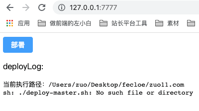

# zuo-deploy
用 js 写一个 CI、CD 工具，实现细节文档: [Vue + Node.js 从 0 到 1 实现自动化部署工具](http://www.zuo11.com/blog/2022/2/zuo_deploy_think.html)

  

npm package

[](https://npmjs.org/package/zuo-deploy)
## 使用
```bash
# 全局安装
npm install zuo-deploy pm2 -g
# 开启服务
zuodeploy start
# ✔ 请指定部署服务监听端口： … 7777
# ✔ 请设置登录密码（默认：888888） … ******

# 访问 127.0.0.1:7777 打开操作界面，密码 888888
```



点击部署，会执行当前目录下的 deploy-master.sh，

需要自己在需要部署的项目里，创建一个 deploy-master.sh 脚本，并添加可执行权限(`chmod +x 文件名`)，如果没有会直接报错，如上图。

```shell
# https://github.com/zuoxiaobai/zuo11.com 部署脚本示例
# deploy-master.sh
echo "开始部署..."

echo "git pull"
git pull 

echo "zuoblog init"
zuoblog init --disable-dev-server

echo "部署完成!"
```


## 服务 log 查询
zuodeploy start 会用 pm2 开启一个 zuodeploy 服务，再次执行 zuodeploy start 会删除原服务，再次开启新服务。**如果开启失败，重新运行一次命令即可**
```bash
# 查看 log
pm2 log
pm2 log zuodeploy --lines 1000 # 指定行
```


## 其他
### 推荐部署脚本
```bash
echo "开始部署..."

# 防止部署 log 中文乱码
git config --global core.quotepath false 

echo "git pull"
git pull 

# 查看最近一次提交 log，了解当前部署的是哪个版本
echo "git log -1"
git log -1 

# 构建相关
# 构建

echo "部署完成!"
```
### eslint+prettier

```bash
# 初始化 package.json
npm init

# 添加 eslint、prettier
npm install eslint@7.32.0 --save-dev
npx eslint --init # 初始化 .eslintrc.json 如果是 js，type 为 module 时改为 .cjs
# 支持 es modlues
# package.json 设置 type 为 module
npm install --save-dev --save-exact prettier
npm install eslint-config-prettier --save-dev # 处理与 eslint 的冲突
npm install eslint-plugin-prettier --save-dev # 将 prettier 以插件形式集成到 eslint 处理流程中
# prettier 如果配置没生效，重启 vscode 即可
# 配置参考 https://github.com/prettier/eslint-plugin-prettier
```

### pm2 相关
防止 terminal node xx.js 进程被杀掉，使用 pm2 像守护进程一样后台执行
```js
pm2 stop zuodeoploy
pm2 start src/index.js -n 'zuodeoploy'
```
跨文件传参, 文件读写

## License
MIT
